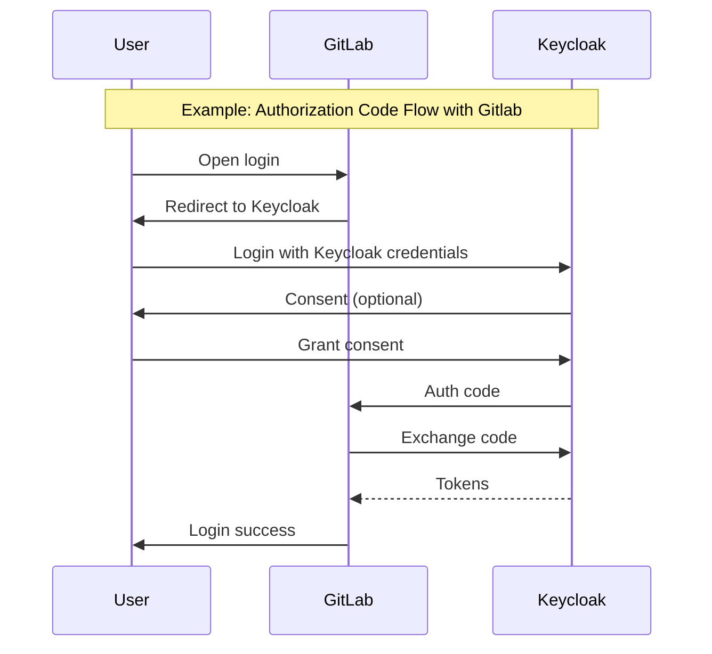
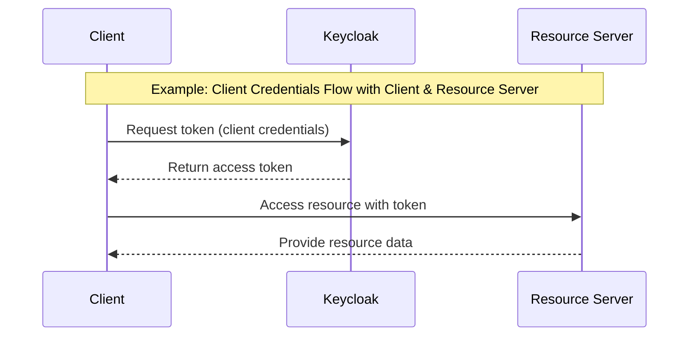
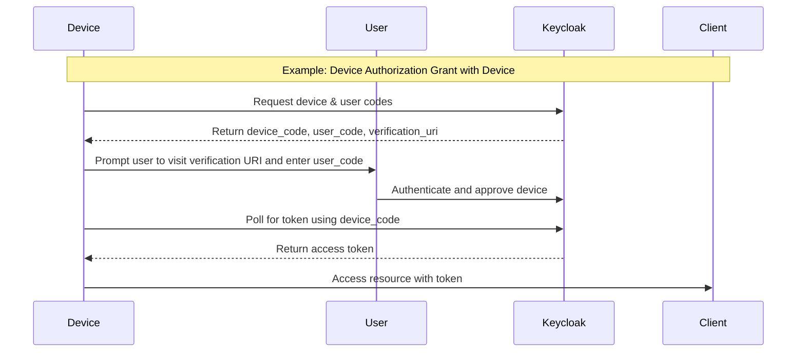

## Introduction

Keycloak is an open-source Identity and Access Management (IAM) solution that provides :

- **Single Sign-On(SSO)**: Users authenticate once and access multiples applications
- **Identity Brokering**: Integration with external identity providers (Google, Github, LDAP etc ...)
- **User Federation**: Connect to existing user directories
- **Authorization Services**: Fine-grained access control for resources other realms
- **Standard Protocols**: OAuth2, OpenID Connect (OIDC), and SAML 2.0 support

## Key Terminology

### Must known vocabulary

- **Realm** : An isolated namespace that manages users, credentials, roles, and groups. Each realm is completely independent
- **Client**: An application or service that can request authentication from Keycloak. Clients can be web applications, mobile apps, or backend services.
- **User**: An entity that can authenticate with Keycloak and access resources. It will often represents your final users
- **Service Account**: A special type of user associated with a client, used for machine-to-machine authentication without human interaction.
- **Role**: A type or category of user. Applications can assign access and permissions to roles rather than individual users.
- **Token**: A signed piece of data that contains information about the authenticated user or client. Common token types include:
  - **Access Token**: Short-lived token used to access protected resources
  - **Refresh Token**: Long-lived token used to obtain new access tokens
  - **ID Token**: Contains user identity information (OpenID Connect)

### OAuth2 Grant Types

Keycloak supports several OAuth2 authentication flows. You can find below their Diagram sequence

:::warning
Keycloak supports other flows that the one defined below, however, due to their nature (sometimes insecure or deprecated ), they won't be shown in this article
:::

#### Authorization Code Flow

Authorization Code Flow is mainly used by web applications with a backend. Most secure flow for user authentication.

#### **Client Credentials Flow**

Client Credentials Flow is mainly used for service-to-service authentication without user interaction

#### **Device Authorization Grant**

The Device Authorization Grant workflow is designed for devices with limited input capabilities or no browser, such as smart TVs, printers, or IoT devices. It allows these devices to obtain an access token securely by delegating user authentication to a separate device like a smartphone or computer.

